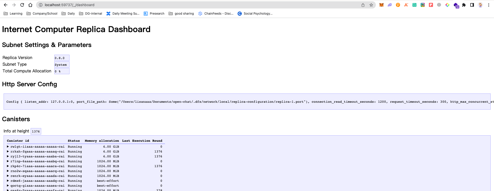
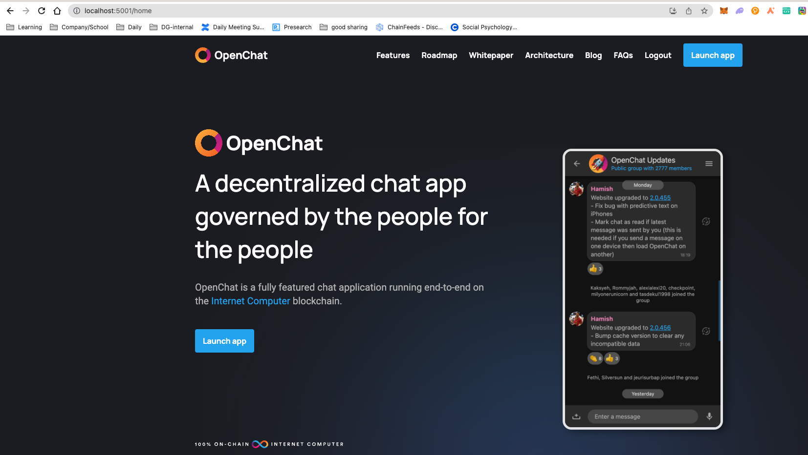

# OpenChat

https://oc.app

OpenChat is a fully featured chat application running end-to-end on the Internet Computer blockchain.

## Testing locally
- You must have DFX version 0.14.2 installed
  - `sh -ci "$(curl -fsSL https://sdk.dfinity.org/install.sh)" DFX_VERSION=0.14.2`
  - refer https://github.com/dfinity/sdk
- You must have Rust installed
  - `curl --proto '=https' --tlsv1.2 -sSf https://sh.rustup.rs | sh`
  - refer https://www.rust-lang.org/tools/install
- To install all the necessary canisters (OpenChat, OpenStorage and NNS)
  - Install and start docker, login with your account as some repositories may need `docker login`
  - Under root path, open terminal#2, run `./scripts/deploy-local.sh`
- To start dfx and all canisters, consider this part as starting back-end services
  - Under root path, open terminal#1, `dfx start`
  - If sometimes there is some issues, run `rm -rf .dfx` and rerun `dfx start` may resolve them

- To run the open-chat website, consider this part as starting front-end services
  - Under path `./frontend/app`, create and save `.env` file with same content from `.env-template` file
  - Under path `./frontend/app`, run `npm run dev`

- Create II and Enjoy it!
- To upgrade a canister, but it's not mandatary in the bootstrap
  - run `./scripts/upgrade-canister-local.sh <DFX_IDENTITY_NAME> <CANISTER_NAME> <VERSION>` (eg. `./scripts/upgrade-canister-local.sh default user 1.0.0`)

## Deterministic builds

We need builds to be deterministic so that code running inside a canister can be verified by comparing the
wasm hash locally with the wasm hash exposed by the IC.

You can build the OpenChat canister wasms by running `./scripts/docker-build.sh`

## License

Copyright 2023 Computism LTD

Licensed under the AGPLv3: https://www.gnu.org/licenses/agpl-3.0.html
